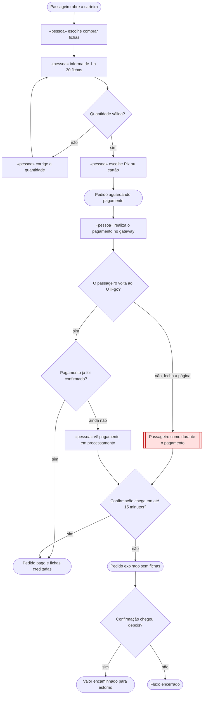

# 🗺️ Jornadas de Usuário

**Projeto:** UTFgo
**Versão:** 1.0.0
**Última atualização:** 2026-10-01

> Este documento registra o que a pessoa vive durante as jornadas críticas do
> produto, com atenção aos pontos em que ela pode esperar, travar ou desistir.

---

## Jornada 1 — Compra de fichas

**Story:** US02 — Compra de fichas
**Critérios que ela marca:** sai do site e volta · depende do tempo · depende
de outra parte agir · pode ser abandonada no meio

**O que decidimos sobre o nó vermelho:**

Se o passageiro fechar a página do pagamento, o pedido continuará aguardando
por até 15 minutos. Fechar a página ou retornar ao UTFgo não libera fichas. Se o
gateway confirmar o pagamento dentro do prazo, as fichas serão creditadas mesmo
que o passageiro não volte naquele momento. Sem confirmação, o pedido expira;
uma confirmação posterior será encaminhada para estorno.

---

## Dúvidas em aberto

Nenhuma no momento.
